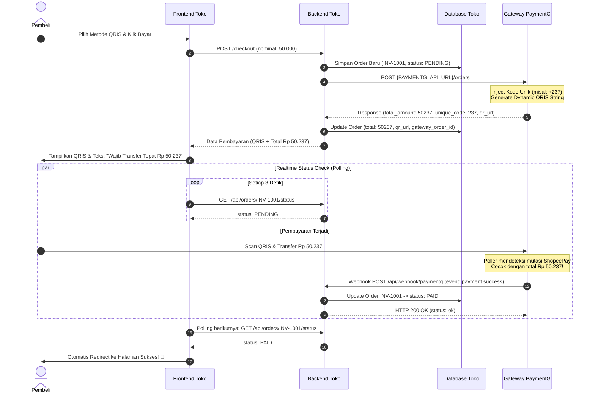

# 🔌 PaymentG Integration Guide (AI Agent & Developer)

Panduan integrasi teknis mandiri (self-contained) untuk **AI Coding Agent** (seperti Antigravity, Cursor, Claude Code, GitHub Copilot) maupun **Software Engineer** yang membangun atau menghubungkan website e-commerce dengan sistem pembayaran QRIS otomatis **PaymentG**.

> 💡 **Informasi untuk Developer:**
> Anda cukup memberikan file ini langsung ke AI Agent Anda di project web toko baru tanpa perlu menjelaskan apa pun lagi. Dokumen ini telah memuat arsitektur end-to-end, skema database, alur UI checkout, webhook receiver, dan mekanisme switching sandbox-to-live.

---

## 📌 Mission Context for AI Agent

```markdown
You are building/integrating the payment module for this e-commerce website using PaymentG.
PaymentG is an automated ShopeePay QRIS gateway with dynamic unique-code matching.
Your tasks:
1. Add environment variables `PAYMENTG_API_URL` and `PAYMENTG_API_KEY` to `.env`.
2. Ensure the orders table stores: `reference_id`, `gateway_order_id`, `original_amount`, `unique_code`, `total_amount`, `status`, and `qr_url`.
3. Create the checkout backend endpoint calling `POST {PAYMENTG_API_URL}/orders`.
4. Build the payment UI displaying the QRIS image, countdown timer, and prominently the EXACT `total_amount` (with the 3-digit unique code).
5. Build an idempotent Webhook receiver at `/api/webhook/paymentg` returning HTTP 200 OK.
6. Provide a status-polling check and a "Saya Sudah Bayar" button on the payment UI.
```

---

## 🔄 Zero-Code Switching (Sandbox ⇄ Live)

Website toko Anda **tidak memerlukan perubahan kode logika apa pun** saat berpindah dari fase uji coba (testing) ke fase produksi (uang asli). Cukup ubah nilai di file `.env`:

### 🧪 1. Mode Testing (Sandbox Simulator)
Gunakan kredensial ini selama pembuatan toko. Tidak menggunakan uang asli, tagihan bisa disimulasikan lunas via tombol **`[💳 Bayar Sekarang]`** di dashboard `/sandbox`:
```env
PAYMENTG_API_URL=https://paymentg.syukurapi.online/api/sandbox
PAYMENTG_API_KEY=ak_sbx_xxxxxxxxxxxxxxxxxxxxxxxx
```

### 🚀 2. Mode Production (Uang Asli)
Tukar ke kredensial ini saat toko siap menerima uang asli pembeli melalui QRIS ShopeePay:
```env
PAYMENTG_API_URL=https://paymentg.syukurapi.online/api
PAYMENTG_API_KEY=ak_xxxxxxxxxxxxxxxxxxxxxxxx
```

---

## 📐 Arsitektur & Alur Kerja End-to-End



---

## 🗄️ Rekomendasi Skema Database Toko

Simpan data transaksi pembayaran pada tabel pesanan website toko Anda:

| Kolom | Tipe Data | Deskripsi |
| :--- | :--- | :--- |
| `id` / `invoice_number` | String (Unique) | Nomor invoice unik toko (dikirim sebagai `reference_id`). Contoh: `INV-2026-0001`. |
| `gateway_order_id` | String | ID order dari PaymentG. Contoh: `ord_xxxx` atau `sbx_ord_xxxx`. |
| `original_amount` | BigInt / Integer | Harga asli pesanan tanpa kode unik (misal: `50000`). |
| `unique_code` | Integer | 3-digit kode unik dari PaymentG (misal: `237`). |
| `total_amount` | BigInt / Integer | **Nominal akhir wajib bayar** (`original_amount + unique_code` = `50237`). |
| `payment_status` | String | `PENDING`, `PAID`, `EXPIRED`, `CANCELLED`. Default: `PENDING`. |
| `qr_url` | String (Nullable) | URL gambar QRIS PNG tagihan. |
| `payment_tx_id` | String (Nullable) | Nomor mutasi ShopeePay (`shopee_tx_id`). |
| `paid_at` | Timestamp (Nullable) | Waktu pembayaran diverifikasi. |
| `expires_at` | Timestamp (Nullable) | Batas waktu bayar (default 15 menit). |

---

## 📡 Kontrak Spesifikasi API PaymentG

Semua komunikasi backend toko ke PaymentG menggunakan format JSON dengan header `X-API-Key`.

### 1. Buat Tagihan QRIS (`POST {PAYMENTG_API_URL}/orders`)

- **Method:** `POST`
- **Headers:**
  ```http
  Content-Type: application/json
  X-API-Key: {PAYMENTG_API_KEY}
  ```
- **Request Body (JSON):**
  ```json
  {
    "reference_id": "INV-2026-0001",
    "amount": 50000,
    "expiry_minutes": 15,
    "metadata": "User: Budi | Order Item #45"
  }
  ```
- **Response Success (HTTP 201 Created):**
  ```json
  {
    "success": true,
    "data": {
      "order_id": "ord_oVVqMw7cBx",
      "reference_id": "INV-2026-0001",
      "original_amount": 50000,
      "unique_code": 237,
      "total_amount": 50237,
      "status": "PENDING",
      "qr_url": "/api/orders/ord_oVVqMw7cBx/qr.png",
      "expires_at": "2026-10-02T16:30:00Z",
      "expires_in_seconds": 900
    }
  }
  ```

---

### 2. URL Gambar QRIS (`qr_url`)

Gambar QR code PNG dapat langsung ditampilkan pada frontend HTML tanpa memerlukan header otorisasi.
URL lengkap gambar QRIS dapat disusun dengan cara:
```javascript
// Opsi A: Gabungkan Host Origin PaymentG + qr_url dari response
const fullQrUrl = new URL(data.qr_url, process.env.PAYMENTG_API_URL).href;

// Opsi B: Akses langsung via endpoint order
// {PAYMENTG_API_URL}/orders/{order_id}/qr.png
```

Contoh di tag HTML:
```html

```

---

### 3. Cek Status Pesanan Manual (`GET {PAYMENTG_API_URL}/orders/:id`)

Dipanggil untuk memeriksa status terkini:
- **Method:** `GET`
- **Headers:** `X-API-Key: {PAYMENTG_API_KEY}`
- **Response (HTTP 200 OK):**
  ```json
  {
    "success": true,
    "data": {
      "order_id": "ord_oVVqMw7cBx",
      "reference_id": "INV-2026-0001",
      "original_amount": 50000,
      "unique_code": 237,
      "total_amount": 50237,
      "status": "PAID",
      "paid_at": "2026-10-02T16:18:24Z",
      "shopee_tx_id": "122722636469377153",
      "created_at": "2026-10-02T16:15:00Z"
    }
  }
  ```

---

### 4. Pemicu Cek Mutasi Instan / Tombol "Saya Sudah Bayar" (`POST {PAYMENTG_API_URL}/orders/:id/check`)

Jika pembeli mengklik tombol *"Saya Sudah Bayar"* pada halaman checkout toko Anda, panggil endpoint ini untuk langsung memicu verifikasi mutasi ShopeePay tanpa menunggu jeda polling otomatis.
- **Method:** `POST`
- **Headers:** `X-API-Key: {PAYMENTG_API_KEY}`

---

## 🔔 Webhook Receiver Specification (Wajib di Web Toko)

PaymentG akan otomatis mengirimkan notifikasi HTTP POST ke URL webhook web toko Anda segera setelah transaksi diverifikasi lunas.

### Format Webhook dari PaymentG:
- **Method:** `POST`
- **Headers:**
  ```http
  Content-Type: application/json
  X-Webhook-Event: payment.success
  ```
- **Body JSON:**
  ```json
  {
    "event": "payment.success",
    "order_id": "ord_oVVqMw7cBx",
    "reference_id": "INV-2026-0001",
    "original_amount": 50000,
    "unique_code": 237,
    "total_amount": 50237,
    "paid_at": "2026-10-02T16:18:24Z",
    "shopee_tx_id": "122722636469377153"
  }
  ```

### Aturan Wajib Webhook Receiver Toko:
1. **Idempoten:** Cek apakah pesanan sudah berstatus `PAID` di database toko. Jika sudah, jangan jalankan proses pemenuhan barang ganda.
2. **Status HTTP 200 OK:** Webhook receiver toko Anda **wajib membalas HTTP 200 OK** dengan body JSON `{ "status": "ok" }`. Jika merespons selain 2xx atau timeout, PaymentG akan menandai pengiriman webhook gagal.

---

## 💻 Contoh Implementasi Backend Siap Pakai

### Pilihan 1: Node.js / Express / Next.js

```javascript
// controllers/paymentController.js
const axios = require('axios');
const db = require('../models/db'); // Database toko Anda

// 1. Endpoint Buat Checkout QRIS
async function createCheckout(req, res) {
    const { invoiceNumber, amount } = req.body;

    try {
        const response = await axios.post(`${process.env.PAYMENTG_API_URL}/orders`, {
            reference_id: invoiceNumber,
            amount: amount,
            expiry_minutes: 15
        }, {
            headers: {
                'Content-Type': 'application/json',
                'X-API-Key': process.env.PAYMENTG_API_KEY
            }
        });

        const orderData = response.data.data;

        // Simpan ke database toko
        await db.Order.create({
            invoice_number: invoiceNumber,
            gateway_order_id: orderData.order_id,
            original_amount: orderData.original_amount,
            unique_code: orderData.unique_code,
            total_amount: orderData.total_amount,
            status: 'PENDING',
            qr_url: orderData.qr_url,
            expires_at: orderData.expires_at
        });

        return res.status(201).json({ success: true, data: orderData });
    } catch (error) {
        console.error('PaymentG create order failed:', error.response?.data || error.message);
        return res.status(500).json({ success: false, error: 'Gagal membuat tagihan QRIS' });
    }
}

// 2. Endpoint Webhook Receiver
async function handleWebhook(req, res) {
    const payload = req.body;

    if (payload.event === 'payment.success') {
        const invoiceNumber = payload.reference_id;
        const txId = payload.shopee_tx_id;

        // Cari pesanan di database toko
        const order = await db.Order.findOne({ where: { invoice_number: invoiceNumber } });
        if (order && order.status !== 'PAID') {
            await order.update({
                status: 'PAID',
                payment_tx_id: txId,
                paid_at: new Date()
            });

            // TODO: Kirim email konfirmasi / aktifkan langganan / kirim produk digital
            console.log(`[ORDER PAID] Invoice ${invoiceNumber} berhasil lunas via Shopee Tx ${txId}!`);
        }
    }

    return res.status(200).json({ status: 'ok' });
}

// 3. Endpoint Cek Status Pembayaran (Untuk Polling Frontend Toko)
async function checkOrderStatus(req, res) {
    const { invoiceNumber } = req.params;
    const order = await db.Order.findOne({ where: { invoice_number: invoiceNumber } });

    if (!order) return res.status(404).json({ error: 'Order tidak ditemukan' });
    return res.json({ status: order.status });
}

module.exports = { createCheckout, handleWebhook, checkOrderStatus };
```

---

### Pilihan 2: PHP / Laravel

```php
<?php

namespace App\Http\Controllers;

use Illuminate\Http\Request;
use Illuminate\Support\Facades\Http;
use App\Models\Order;

class PaymentController extends Controller
{
    // 1. Buat Pesanan Checkout QRIS
    public function createCheckout(Request $request)
    {
        $invoice = 'INV-' . time();
        $amount = (int) $request->input('amount');

        $response = Http::withHeaders([
            'Content-Type' => 'application/json',
            'X-API-Key'    => env('PAYMENTG_API_KEY'),
        ])->post(rtrim(env('PAYMENTG_API_URL'), '/') . '/orders', [
            'reference_id'   => $invoice,
            'amount'         => $amount,
            'expiry_minutes' => 15,
        ]);

        if (!$response->successful()) {
            return response()->json(['error' => 'Gagal membuat tagihan pembayaran'], 500);
        }

        $orderData = $response->json('data');

        Order::create([
            'invoice_number'   => $invoice,
            'gateway_order_id' => $orderData['order_id'],
            'original_amount'  => $orderData['original_amount'],
            'unique_code'      => $orderData['unique_code'],
            'total_amount'     => $orderData['total_amount'],
            'status'           => 'PENDING',
            'qr_url'           => $orderData['qr_url'],
            'expires_at'       => $orderData['expires_at'],
        ]);

        return response()->json($orderData, 201);
    }

    // 2. Webhook Receiver
    public function handleWebhook(Request $request)
    {
        $payload = $request->json()->all();

        if (($payload['event'] ?? '') === 'payment.success') {
            $invoice = $payload['reference_id'];
            $order = Order::where('invoice_number', $invoice)->first();

            if ($order && $order->status !== 'PAID') {
                $order->update([
                    'status'        => 'PAID',
                    'payment_tx_id' => $payload['shopee_tx_id'],
                    'paid_at'       => now(),
                ]);

                // TODO: Kirim notifikasi WhatsApp atau proses pesanan pembeli
            }
        }

        return response()->json(['status' => 'ok'], 200);
    }
}
```

---

## 🎨 Best Practices Halaman UI Checkout (Frontend)

Ketika menampilkan QRIS kepada pembeli:

1. **Tonjolkan Nominal Wajib Transfer:**
   - Gunakan format visual yang jelas:
     > **Wajib transfer tepat:** **`Rp 50.237`** *(termasuk 3 digit kode unik `237`)*.
     > *Jangan bulatkan transfer ke Rp 50.000 agar pesanan otomatis terverifikasi sistem!*
2. **Pasang Realtime Polling Interval (3 Detik):**
   ```javascript
   const checkTimer = setInterval(async () => {
       const res = await fetch(`/api/orders/${invoiceNumber}/status`);
       const data = await res.json();
       if (data.status === 'PAID') {
           clearInterval(checkTimer);
           window.location.href = `/checkout/success?invoice=${invoiceNumber}`;
       }
   }, 3000);
   ```
3. **Tombol "Saya Sudah Bayar":**
   Sediakan tombol pemicu manual untuk pembeli yang tidak sabar:
   ```javascript
   async function manualCheck() {
       btn.disabled = true;
       btn.innerText = "Memeriksa mutasi...";
       await fetch(`${PAYMENTG_API_URL}/orders/${gatewayOrderId}/check`, {
           method: 'POST',
           headers: { 'X-API-Key': PAYMENTG_API_KEY }
       });
   }
   ```
4. **Countdown Timer:**
   Hitung mundur 15 menit dari `expires_at`. Jika waktu habis, ubah status tampilan menjadi *"Tagihan Kedaluwarsa"* dan sediakan tombol *"Buat Tagihan Baru"*.

---

## 🧪 Alur Uji Coba Cepat (Mode Sandbox Simulator)

Sebelum toko go-live:
1. Daftarkan web toko Anda di `https://paymentg.syukurapi.online/sandbox/` pada tab **"🔑 Kelola Web Toko"**. Masukkan PIN `2207`.
2. Masukkan nama web dan URL webhook Anda (misal: `https://webtoko.com/api/webhook/paymentg`).
3. Dapatkan API Key sandbox (`ak_sbx_...`), simpan di `.env` web toko Anda.
4. Lakukan checkout di web toko Anda.
5. Buka dashboard `/sandbox/` tab **"📜 Mutasi Transaksi"**, Anda akan melihat order berstatus `PENDING` dengan tombol hijau **`[💳 Bayar Sekarang]`**.
6. Klik tombol tersebut! PaymentG akan seketika:
   - Mengubah order menjadi `PAID`.
   - Menembakkan webhook nyata ke URL webhook web toko Anda.
   - Menampilkan status respons webhook (HTTP 200 OK) di Webhook Inspector.
   - Halaman pembeli di web toko Anda seketika mendeteksi lunas dan melakukan redirect sukses!

---

## ✅ Integration Checklist for AI Agent

Sebelum menyelesaikan tugas integrasi web toko, pastikan poin-poin berikut telah lengkap:
- [ ] Kredensial `.env` memuat `PAYMENTG_API_URL` dan `PAYMENTG_API_KEY`.
- [ ] Database toko menyimpan `reference_id`, `gateway_order_id`, `total_amount`, dan `status`.
- [ ] Tampilan frontend checkout menonjolkan **`total_amount`** (nominal tepat dengan 3 digit unik).
- [ ] Webhook receiver memproses event `payment.success` secara idempoten dan mengembalikan status HTTP `200 OK`.
- [ ] Frontend memiliki polling status otomatis dan penanganan redirect saat status menjadi `PAID`.
- [ ] Webhook URL telah didaftarkan pada dashboard PaymentG.
